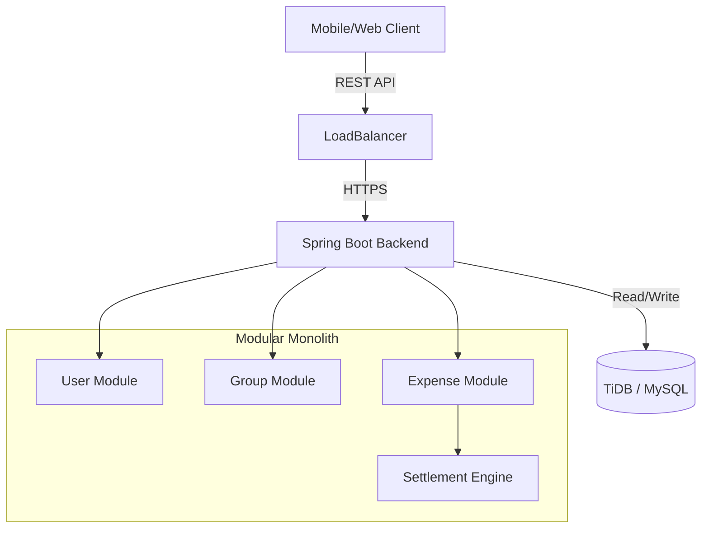

<div align="center">
  <!-- You can replace this placeholder with a real logo if you have one -->
  <h1>💸 GroupPay </h1>
  
  <p>
    <strong>Advanced Expense Splitting & Settlement Engine</strong>
  </p>

  <p>
    <a href="#-features">Features</a> •
    <a href="#-tech-stack">Tech Stack</a> •
    <a href="#-api-documentation">API Docs</a> •
    <a href="#-getting-started">Getting Started</a> •
    <a href="#-deployment">Deployment</a>
  </p>

  <p>
    
    
    
    
    
  </p>
</div>

---

##  Overview

**GroupPay** is a high-performance backend system engineered to simplify complex group finances. Think of it as the engine behind a "Pro" version of Splitwise. It handles user authentication, complex expense splitting (Equal, Exact, Percentage), and features a **smart settlement algorithm** to minimize the number of transactions needed to settle up.

---

##  Project Status & Roadmap

> **Current Status**: ✅ Core Backend Complete (Deployed)

| Phase | Feature | Status |
| :--- | :--- | :--- |
| **Phase 1** | JWT Auth, Groups, Settlements | ✅ **Completed** |
| **Phase 1** | Dockerization & Cloud Deployment | ✅ **Completed** |
| **Phase 2** | Password Reset Flow | ✅ **Completed** |
| **Phase 3** | WebSocket Notifications | 🚧 *In Progress* |
| **Future** | Social Login (Google/FB) | 📅 *Planned* |
| **Future** | Native Android App Integration | 📅 *Planned* |

---

##  Features

<table>
  <tr>
    <td width="50%">
      <h3> Robust Security</h3>
      <ul>
        <li><strong>JWT Authentication</strong>: Stateless & Scalable.</li>
        <li><strong>Password Reset Flow</strong>: Secure email-token verify loop.</li>
        <li><strong>OAuth2 Ready</strong>: Modular design for Social Logins.</li>
      </ul>
    </td>
    <td width="50%">
      <h3> Smart Financials</h3>
      <ul>
        <li><strong>Dynamic Splitting</strong>: Handles <em>Equal</em>, <em>Exact</em> amounts, and <em>Percentages</em>.</li>
        <li><strong>Algorithm</strong>: Graph-based debt simplification.</li>
        <li><strong>Precision</strong>: <code>BigDecimal</code> for financial accuracy.</li>
      </ul>
    </td>
  </tr>
  <tr>
    <td width="50%">
      <h3> Group Dynamics</h3>
      <ul>
        <li>Deep linking for group invites.</li>
        <li>Cascading deletion for clean data management.</li>
        <li>Role-based access control (Admin/User).</li>
      </ul>
    </td>
    <td width="50%">
      <h3> Modern Tech</h3>
      <ul>
        <li><strong>Dockerized</strong>: "Run anywhere" container.</li>
        <li><strong>Swagger UI</strong>: Interactive API playground.</li>
        <li><strong>Cloud Native</strong>: TiDB & Render optimized.</li>
      </ul>
    </td>
  </tr>
</table>

---

## 🛠 Tech Stack

| Component | Technology | Description |
| :--- | :--- | :--- |
| **Language** | Java 21 | Latest LTS version for performance. |
| **Framework** | Spring Boot 3.4 | Core framework for DI & Web MVC. |
| **Database** | MySQL 8 / TiDB | Relational persistence. Cluster-ready. |
| **Security** | Spring Security 6 | JWT + BCrypt + CSRF protection. |
| **Docs** | SpringDoc OpenAPI | Automated Swagger UI generation. |
| **Ops** | Docker | Multi-stage build for optimized image size. |

---

##  The Algorithm: Minimum Cash Flow

GroupPay isn't just a CRUD app; it solves the NP-hard problem of **debt simplification** efficiently using a **Greedy Minimum Cash Flow Algorithm**.

### The Problem
Imagine 3 friends: **Ram**, **Sham**, and **Krishna**.
1.  **Ram** pays **₹50** for Sham.
2.  **Sham** pays **₹50** for Krishna.

**Naive Approach (2 Transactions):**
*   Sham gives Ram ₹50.
*   Krishna gives Sham ₹50.
*   *Sham is just a middleman moving money!*

### The Solution (1 Transaction) 
Our algorithm calculates the **Net Balance** for each person:
*   Ram: **+₹50** (He is owed)
*   Sham: **0** (Owes 50, Owed 50 -> Net 0)
*   Krishna: **-₹50** (He owes)

**Optimized Result:**
*   **Krishna pays Ram ₹50 directly.**
*   Sham does nothing.

### Why this is better?
Drastically reduces bank transfers in large groups.
*   **Input**: N people with M transactions.
*   **Output**: At most N-1 transactions to settle EVERYONE.

---

## 📚 API Documentation

Explore the API interactively. No external tools needed.

| Environment | URL | Status |
| :--- | :--- | :--- |
| **Live Demo** | [**Launch Swagger UI 🚀**](https://grouppay-8w7j.onrender.com/swagger-ui/index.html) | 🟢 Online |
| **Localhost** | [View Local Docs](http://localhost:8081/swagger-ui/index.html) | 🟡 When running |

### 🔑 Key Endpoints

| Method | Endpoint | Description | Auth? |
| :--- | :--- | :--- | :--- |
| `POST` | `/auth/register` | Register a new user | ❌ |
| `POST` | `/auth/login` | Login & receive JWT | ❌ |
| `POST` | `/auth/forgot-password` | Request password reset token | ❌ |
| `GET` | `/groups` | List all groups for user | ✅ |
| `POST` | `/groups` | Create a new group | ✅ |
| `POST` | `/expenses` | Add a split expense | ✅ |
| `GET` | `/settlements/group/{id}` | Calculate settlement graph | ✅ |

### 📝 Example Request (cURL)

**Register a User:**
```bash
curl -X POST "https://your-app-url.onrender.com/auth/register" \
  -H "Content-Type: application/json" \
  -d '{
    "username": "mahir_dev",
    "email": "mahir@example.com",
    "password": "securePassword123"
  }'
```

---

## ✅ Prerequisites

Ensure you have the following installed before running locally:

*   **Java 21** (JDK) 
*   **MySQL 8.0** (or compatible) 
*   **Maven 3.9+** 
*   **Docker & Docker Compose** (Optional, for containerization) 

##  Getting Started

<details>
<summary><strong> Option 1: Run with Docker (Recommended)</strong></summary>

```bash
# 1. Build the image
docker build -t grouppay-backend .

# 2. Run container (With env vars)
docker run -p 8081:8081 \
  -e SPRING_DATASOURCE_URL="jdbc:mysql://host:port/db" \
  -e SPRING_DATASOURCE_USERNAME="root" \
  -e SPRING_DATASOURCE_PASSWORD="password" \
  grouppay-backend
```
</details>

<details>
<summary><strong> Option 2: Run from Source</strong></summary>

1.  **Clone & Configure**:
    Update `src/main/resources/application.yml` with your DB creds.
2.  **Run**:
    ```bash
    ./mvnw spring-boot:run
    ```
3.  **Access**:
    Server starts at `http://localhost:8081`
</details>

---

##  Architecture

The project is built as a **Modular Monolith**, ensuring strict boundaries exist between features (User, Group, Expense) while keeping the deployment simple.

###  System Design


## 📂 Project Structure

The project follows a **Domain-Driven Design (DDD)** architecture. Each feature (User, Group, Expense) is a self-contained module with its own API, Service, and Repository layers.

```bash
com.grouppay
├──  user
│   ├── api            # AuthController (Login, Register, ForgotPwd)
│   ├── application    # PasswordResetService, LoginUserService
│   └── domain         # User Entity, PasswordResetToken
├──  group
│   ├── api            # GroupController
│   └── application    # GroupService, MemberService
├──  expense
│   ├── api            # ExpenseController
│   └── domain         # Expense, ExpenseSplit (Polymorphic inputs)
├──  settlement
│   ├── application
│   │   ├── MinimumCashFlowService.java  #  The Greedy Algorithm
│   │   └── BalanceCalculationService.java
│   └── domain         # Settlement Entity
├──  notification
│   └── event          # ExpenseAddedEvent, MemberAddedEvent
└──  security        # JwtAuthenticationFilter, SecurityConfig
```

---

<div align="center">
  <p>
    <sub> Engineered and Developed by <a href="https://github.com/Mahir-Agarwal">Mahir Aggarwal</a></sub>
  </p>
</div>
