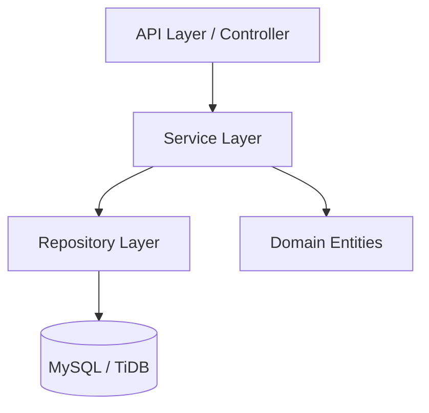

<div align="center">
  <!-- You can replace this placeholder with a real logo if you have one -->
  <h1>💸 GroupPay</h1>
  
  <p>
    <strong>Advanced Expense Splitting & Settlement Engine</strong>
  </p>

  <p>
    <a href="#-features">Features</a> •
    <a href="#-tech-stack">Tech Stack</a> •
    <a href="#-api-documentation">API Docs</a> •
    <a href="#-getting-started">Getting Started</a> •
    <a href="#-deployment">Deployment</a>
  </p>

  <p>
    
    
    
    
    
  </p>
</div>

---

## 🚀 Overview

**GroupPay** is a high-performance backend system engineered to simplify complex group finances. Think of it as the engine behind a "Pro" version of Splitwise. It handles user authentication, complex expense splitting (Equal, Exact, Percentage), and features a **smart settlement algorithm** to minimize the number of transactions needed to settle up.

---

## ✨ Features

<table>
  <tr>
    <td width="50%">
      <h3>🔐 Robust Security</h3>
      <ul>
        <li><strong>JWT Authentication</strong>: Stateless & Scalable.</li>
        <li><strong>Password Reset Flow</strong>: Secure email-token verify loop.</li>
        <li><strong>OAuth2 Ready</strong>: Modular design for Social Logins.</li>
      </ul>
    </td>
    <td width="50%">
      <h3>💰 Smart Financials</h3>
      <ul>
        <li><strong>Dynamic Splitting</strong>: Handles <em>Equal</em>, <em>Exact</em> amounts, and <em>Percentages</em>.</li>
        <li><strong>Algorithm</strong>: Graph-based debt simplification.</li>
        <li><strong>Precision</strong>: <code>BigDecimal</code> for financial accuracy.</li>
      </ul>
    </td>
  </tr>
  <tr>
    <td width="50%">
      <h3>👥 Group Dynamics</h3>
      <ul>
        <li>Deep linking for group invites.</li>
        <li>Cascading deletion for clean data management.</li>
        <li>Role-based access control (Admin/User).</li>
      </ul>
    </td>
    <td width="50%">
      <h3>⚡ Modern Tech</h3>
      <ul>
        <li><strong>Dockerized</strong>: "Run anywhere" container.</li>
        <li><strong>Swagger UI</strong>: Interactive API playground.</li>
        <li><strong>Cloud Native</strong>: TiDB & Render optimized.</li>
      </ul>
    </td>
  </tr>
</table>

---

## 🛠 Tech Stack

| Component | Technology | Description |
| :--- | :--- | :--- |
| **Language** | Java 21 | Latest LTS version for performance. |
| **Framework** | Spring Boot 3.4 | Core framework for DI & Web MVC. |
| **Database** | MySQL 8 / TiDB | Relational persistence. Cluster-ready. |
| **Security** | Spring Security 6 | JWT + BCrypt + CSRF protection. |
| **Docs** | SpringDoc OpenAPI | Automated Swagger UI generation. |
| **Ops** | Docker | Multi-stage build for optimized image size. |

---

## 📚 API Documentation

Explore the API interactively. No external tools needed.

| Environment | URL | Status |
| :--- | :--- | :--- |
| **Live Demo** | [**Launch Swagger UI 🚀**](https://grouppay-8w7j.onrender.com/swagger-ui/index.html) | 🟢 Online |
| **Localhost** | [View Local Docs](http://localhost:8081/swagger-ui/index.html) | 🟡 When running |

> **Key Endpoints:**
> *   `POST /auth/register` - Onboard new users
> *   `POST /auth/forgot-password` - Recovery flow
> *   `POST /expenses` - The core ledger entry
> *   `GET /settlements/group/{id}/calculate` - The settling engine

---

## ⚡ Getting Started

<details>
<summary><strong>🏃‍♂️ Option 1: Run with Docker (Recommended)</strong></summary>

```bash
# 1. Build the image
docker build -t grouppay-backend .

# 2. Run container (With env vars)
docker run -p 8081:8081 \
  -e SPRING_DATASOURCE_URL="jdbc:mysql://host:port/db" \
  -e SPRING_DATASOURCE_USERNAME="root" \
  -e SPRING_DATASOURCE_PASSWORD="password" \
  grouppay-backend
```
</details>

<details>
<summary><strong>💻 Option 2: Run from Source</strong></summary>

1.  **Clone & Configure**:
    Update `src/main/resources/application.yml` with your DB creds.
2.  **Run**:
    ```bash
    ./mvnw spring-boot:run
    ```
3.  **Access**:
    Server starts at `http://localhost:8081`
</details>

---

## 📂 Architecture

The project adheres to **Domain-Driven Design (DDD)** principles to separate concerns cleanly.



*   `com.grouppay.user`: Identity & Access Management.
*   `com.grouppay.group`: Relationship logic.
*   `com.grouppay.expense`: Financial transactions.
*   `com.grouppay.settlement`: Graph algorithms for debt.

---

<div align="center">
  <p>
    <sub>Developed with ❤️ by <a href="https://github.com/Mahir-Agarwal">Mahir Aggarwal</a></sub>
  </p>
</div>
